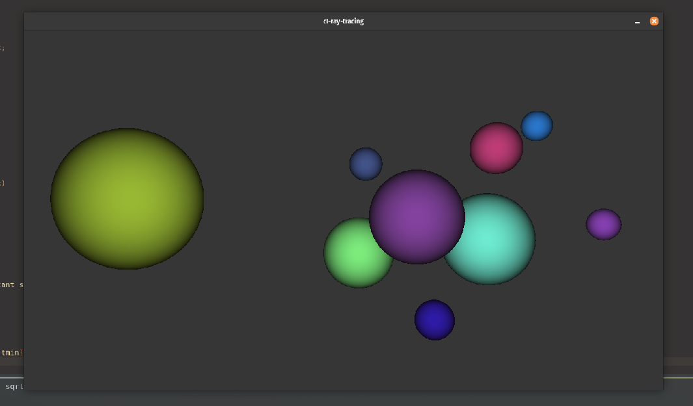

# Ray tracing with OpenGL and OpenCL


```cl-ray-tracing``` implements a basic GPU-based realtime ray tracer. The rays are getting traced on the GPU with OpenCL 1.2 and the created image is displayed using OpenGL 3.3.

# Dependencies on Ubuntu 20.04
### running
* [OpenGL 3.3](doc/checking-opengl.md)
* [OpenCL 1.2](doc/installing-rocm.md)

### building
* cmake
* libglfw3-dev
* libglew-dev
* rocm-dev

# How to Build
1. ```cd raytracing```
2. ```./build.sh``` (debug build) or ```./build.sh -r``` (release build)
3. built binary ```cl-ray-tracing``` will be in ```build/debug/``` or ```build/release/```, respectively
